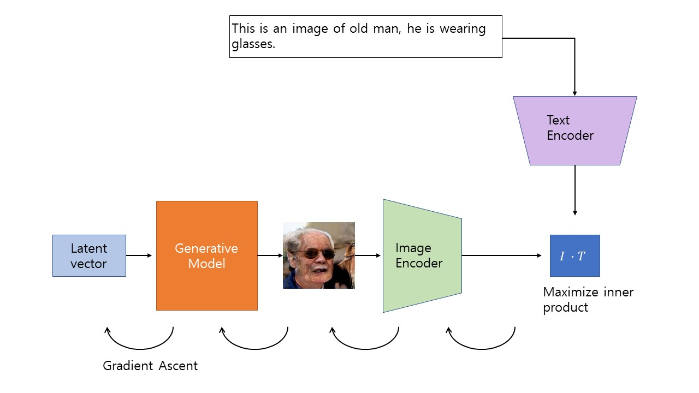
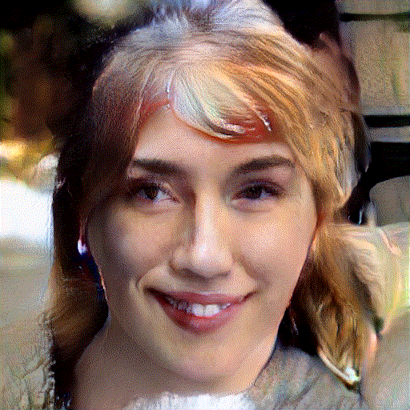

# clipping-CLIP-to-GAN

  

## Introduction

Recently, openAI proposed CLIP : multimodal transformer based model that can perform incredible wide-domain zero shot tasks. You can read all about it from [openAI's blog](https://openai.com/blog/clip/) and it's [paper](https://cdn.openai.com/papers/Learning_Transferable_Visual_Models_From_Natural_Language_Supervision.pdf).
On the other hand, DALL-E, which is generative model, has also been released on the same date, but it is currently not-released and probably end up like GPT-3.

More recently, [Ryan Murdock](https://twitter.com/advadnoun) proposed that good feature visualization should generate some image that matches the text : mainly, he used SIREN as a set of parameters to optimize over and used autograd to learn the best parameters that generates image that matches given set of images.

In general, this could be done with any kind of deterministic generative model, such as GAN, VAE, (I think VQVAE would be really good here too, but the gradient ascent part is still something to implement).

This repository contains test.py, that in general takes generative model and learnable latent vector to find image matching input text.

The models I used here are CLIP (obviously, https://github.com/openai/CLIP), and [FastGAN](https://github.com/odegeasslbc/FastGAN-pytorch). 
## Sampled Examples with GAN on FFHQ dataset

  

**Input Text : This is an image of young boy. He is 2 years old. He is just a baby.**

  

**Input Text : This is an image of old woman. She is from France.**

  

**Input Text : This is an image of old man, he is wearing glasses.**

  

**Input Text : This is an image of young woman, she is african american.**

Ethnicity, gender, age, and other features weren't disentangled. They were just "found" by the text prompt, which is really interesting. I also found that if initial latent vector (so initial person I guess...?) is very different from what we are aiming to (such as example 3 in this case), then it is very difficult to learn with small learning rates.

## How To Use
You can get this running immediately by git clone and downloading pre-trained model from [here, (test.py used FFHQ)](https://drive.google.com/drive/folders/1nCpr84nKkrs9-aVMET5h8gqFbUYJRPLR) and put it in /models folder. In test.py, everything is fixed with random seed, which will yield same results for all the example text inputs. I tried to make everything very easy and comprehensible! If you have any trouble let me know!
